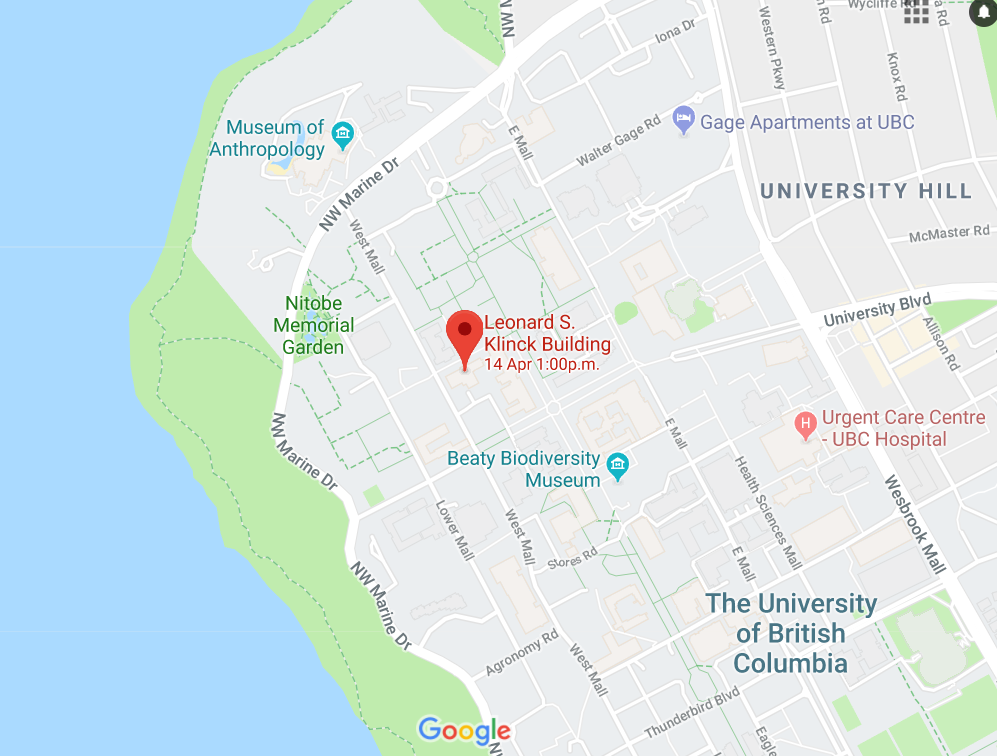

# Learn R!
### Workshop setup instructions
R-Ladies-Vancouver  
April 2, 2018 

### Prior to the workshop

---

**1. Install R and RStudio**

* [R](https://cran.r-project.org/)
* [RStudio](https://www.rstudio.com/products/rstudio/#Desktop)

**2. Download the Titanic dataset**

In this workshop we will be working withan open data set on the infamous Titanic disaster from [Kaggle]. Please download this dataset prior to the workshop:

* Follow this [link](https://drive.google.com/open?id=1iK6tiBsb4cabyi7mP5FLCH6LWYs4hOSI)
* Download and save the csv file

### Workshop outline

---

1. RStudio orientation & good practices for data analysis   
2. Basics of coding in R  
3. Working with functions and packages  
4. Loading and inspecting the titanic.csv dataset
5. Basics of data wrangling with the `dplyr` package  
6. Basics of data plotting with the `ggplot2` package  

Learning materials can be accessed

*[Slides](https://docs.google.com/presentation/d/1ZhVXBN7cJfRrQuR2BAmUNfxt9-wMDb1_y6bt5NoWjag/edit?usp=sharing) 
*[Notes](https://github.com/R-Ladies-Vancouver/April2018-Learn-R-Beginner/blob/master/Learn-R-tutorial.md)

### Time & Location

---

Time: 1-4 pm

**UBC Campus**  
Leonard S. Klinck Building | Room 121  
6356 Agricultural Road | Vancouver, BC V6T 1Z2 

Parking:Fraser River Parkade (6440 Memorial Rd) or West Parkade (2140 Lower Mall). Both ~ $8 for weekend parking.

